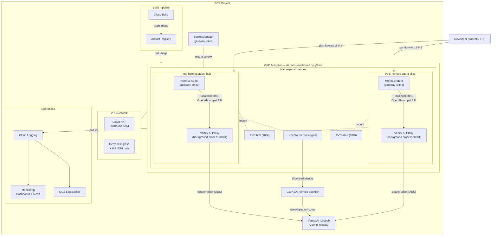

# Hermes Agent on GCP GKE Autopilot

Deploy [Hermes Agent](https://github.com/nousresearch/hermes-agent) on Google Cloud with GKE Autopilot, gVisor sandboxing, and Vertex AI — fully managed by Terraform.

---

## Table of Contents

- [Architecture](#architecture)
- [Security Enhancements](#security-enhancements)
- [Deployment Guide](#deployment-guide)
- [Adding Messaging Channels](#adding-messaging-channels)
  - [Telegram](#telegram)
  - [LINE](#line)
- [Testing with TUI](#testing-with-tui)

---

## Architecture

[Back to top](#table-of-contents)



### Component Overview

| Component | Purpose |
|-----------|---------|
| **GKE Autopilot** | Managed Kubernetes with automatic gVisor sandboxing on every pod |
| **Vertex AI Proxy** | Lightweight Python background process (~200 LOC) replacing LiteLLM; runs inside the same container and injects ADC Bearer tokens into OpenAI-compatible requests |
| **Workload Identity** | Maps K8s ServiceAccount to GCP SA — no API keys stored anywhere |
| **Per-Developer Pods** | Each developer gets an isolated pod + PVC with their own Hermes instance |
| **Cloud Build** | Builds and pushes the Hermes container image to Artifact Registry |
| **Cloud Monitoring** | Dashboard with 5 tiles, alert policies for pod crashes and proxy errors |
| **Cloud Logging** | Logs routed to GCS with lifecycle policies (90d Nearline, 365d Coldline) |

[Back to top](#table-of-contents)

---

## Security Enhancements

[Back to top](#table-of-contents)

### gVisor Kernel-Level Sandboxing

Every pod on GKE Autopilot runs inside a [gVisor](https://gvisor.dev/) sandbox automatically. gVisor intercepts all system calls from the container and re-implements them in a user-space kernel (`runsc`). This means:

- **Kernel exploit isolation** — Even if Hermes executes malicious code, it cannot reach the host kernel. The attack surface is reduced from ~400 Linux syscalls to the subset gVisor implements.
- **No nested virtualization overhead** — Unlike the previous Kata Container approach (which ran full VMs), gVisor operates at the syscall level with lower memory and startup cost.
- **Zero configuration** — Autopilot enforces gVisor on all workloads. There is no way to opt out, eliminating misconfiguration risk.

### Zero API Keys in the Cluster

The entire authentication chain uses identity federation — no secrets containing API keys exist:

```
Pod → K8s ServiceAccount → Workload Identity → GCP Service Account → Vertex AI
```

- The Vertex AI proxy calls `google.auth.default()` to obtain credentials via the metadata server.
- Tokens are automatically refreshed before expiry — no key rotation needed.
- The only secret stored is the gateway auth token (auto-generated, stored in Secret Manager).

### Network Isolation

| Control | Implementation |
|---------|---------------|
| Private GKE nodes | `enable_private_nodes = true` — nodes have no public IPs |
| Cloud NAT | Outbound-only internet access for pulling images and calling Vertex AI |
| Deny-all ingress firewall | Default deny on the VPC; only IAP SSH (35.235.240.0/20) is allowed |
| Master authorized networks | Control plane access restricted to the GKE subnet + explicitly listed CIDRs |
| Per-developer PVC isolation | Each developer's data is on a separate PersistentVolumeClaim — no shared filesystem |

### IAM Least Privilege

The Hermes Agent service account has only:

| Role | Purpose |
|------|---------|
| `roles/aiplatform.user` | Call Vertex AI Gemini models |
| `roles/logging.logWriter` | Write structured logs |
| `roles/monitoring.metricWriter` | Write custom metrics |
| `roles/secretmanager.secretAccessor` | Read gateway token (per-secret binding, not project-wide) |

[Back to top](#table-of-contents)

---

## Deployment Guide

[Back to top](#table-of-contents)

### Prerequisites

- [Terraform](https://developer.hashicorp.com/terraform/install) >= 1.5
- [gcloud CLI](https://cloud.google.com/sdk/docs/install) authenticated with a project owner account
- [kubectl](https://kubernetes.io/docs/tasks/tools/) installed
- A GCP project with billing enabled

### Step 1: Create the GCP Project and State Bucket

```bash
export PROJECT_ID="your-project-id"

gcloud projects create $PROJECT_ID --name="Hermes Agent"
gcloud config set project $PROJECT_ID

# Link billing account
gcloud billing accounts list
gcloud billing projects link $PROJECT_ID --billing-account=XXXXXX-XXXXXX-XXXXXX

# Create Terraform state bucket
gsutil mb -p $PROJECT_ID -l us-central1 gs://${PROJECT_ID}-tf-state
gsutil versioning set on gs://${PROJECT_ID}-tf-state
```

### Step 2: Configure Variables

Edit `terraform.tfvars`:

```hcl
# Required
project_id = "your-project-id"

# Region for GKE and Artifact Registry
region          = "us-central1"

# Vertex AI endpoint region ("global" recommended for widest model availability)
vertex_location = "global"

# Default model
hermes_default_model = "gemini-3.1-flash-lite-preview"

# Model aliases (short name -> Vertex AI model ID)
vertex_model_aliases = {
  "gemini-3.1-flash-lite-preview" = "gemini-3.1-flash-lite-preview"
  "gemini-2.5-flash"              = "gemini-2.5-flash"
}

# Developers -- each gets a dedicated pod and 10Gi PVC
developers = {
  "alice" = { active = true }
  "bob"   = { active = true }
}

# Control plane access (add your IP/CIDR)
master_authorized_cidrs = {
  "My IP" = "YOUR_IP/32"
}

# Alerts (optional)
alert_email = "you@example.com"
```

Update the backend bucket in `main.tf`:

```hcl
backend "gcs" {
  bucket = "your-project-id-tf-state"
  prefix = "hermes-gke"
}
```

### Step 3: Deploy

```bash
terraform init
terraform plan
terraform apply
```

This will:
1. Enable all required GCP APIs
2. Create VPC, subnet, Cloud NAT, firewall rules
3. Create GKE Autopilot cluster with Workload Identity
4. Build the Hermes container image via Cloud Build
5. Deploy per-developer pods, PVCs, services, and secrets
6. Set up monitoring dashboard, alert policies, and log sink

Deployment takes approximately 10-15 minutes (GKE Autopilot cluster creation is the bottleneck).

### Step 4: Verify

```bash
# Check pods are running
kubectl get pods -n hermes

# Check gVisor is active (Seccomp field should be "2")
kubectl get pods -n hermes -o jsonpath='{range .items[*]}{.metadata.name}{"\t"}{.spec.securityContext}{"\n"}{end}'

# Check Vertex AI proxy health
kubectl exec -n hermes deploy/hermes-agent-alice -- \
  curl -s http://127.0.0.1:8081/health
# Expected: {"status":"ok"}

# Check available models
kubectl exec -n hermes deploy/hermes-agent-alice -- \
  curl -s http://127.0.0.1:8081/v1/models
```

### Step 5: Test via kubectl exec

Hermes TUI runs inside the pod — connect directly with `kubectl exec`:

```bash
export PROJECT_ID="your-project-id"

# Ensure Cloud Shell IP is in master_authorized_cidrs, then get credentials
gcloud container clusters get-credentials hermes-cluster \
  --region us-central1 --project $PROJECT_ID

# Interactive shell into a developer pod
kubectl exec -it -n hermes deploy/hermes-agent-alice -- bash

# Inside the pod, test the proxy
curl -s http://127.0.0.1:8081/health
curl -s http://127.0.0.1:8081/v1/models

# Test a chat completion
curl -s http://127.0.0.1:8081/v1/chat/completions \
  -H 'Content-Type: application/json' \
  -d '{"model":"gemini-2.5-flash","messages":[{"role":"user","content":"Hello"}]}'
```

> **Note:** The `hermes` CLI is only available inside the pod, not on Cloud Shell.
> Make sure your Cloud Shell external IP is listed in `master_authorized_cidrs`
> in `terraform.tfvars`, or `kubectl` will time out connecting to the cluster.

[Back to top](#table-of-contents)

---

## Adding Messaging Channels

[Back to top](#table-of-contents)

Hermes Agent supports messaging platforms as channels. Each platform requires a bot token and configuration in the pod environment.

### Telegram

[Back to top](#table-of-contents)

#### 1. Create a Telegram Bot

1. Open Telegram and message [@BotFather](https://t.me/BotFather)
2. Send `/newbot` and follow the prompts
3. Copy the bot token (format: `123456789:ABCdefGHIjklMNOpqrsTUVwxyz`)
4. Send `/setprivacy` → select your bot → choose `Disable` (so the bot can read group messages)

#### 2. Store the Token in Secret Manager

```bash
echo -n "YOUR_BOT_TOKEN" | gcloud secrets create hermes-telegram-token \
  --project=$PROJECT_ID \
  --data-file=- \
  --replication-policy=automatic
```

#### 3. Grant Access to Hermes SA

```bash
gcloud secrets add-iam-policy-binding hermes-telegram-token \
  --project=$PROJECT_ID \
  --member="serviceAccount:hermes-agent@${PROJECT_ID}.iam.gserviceaccount.com" \
  --role="roles/secretmanager.secretAccessor"
```

#### 4. Add Environment Variables to the Deployment

Add these `env` blocks to the container spec in `kubernetes.tf` (inside the `kubernetes_deployment` resource):

```hcl
env {
  name  = "TELEGRAM_BOT_TOKEN"
  value_from {
    secret_key_ref {
      name = "hermes-telegram-token"  # Create as K8s secret
      key  = "token"
    }
  }
}
env {
  name  = "TELEGRAM_ALLOWED_USERS"
  value = "YOUR_TELEGRAM_USER_ID"  # Comma-separated user IDs
}
```

Create the corresponding K8s secret:

```bash
kubectl create secret generic hermes-telegram-token \
  -n hermes \
  --from-literal=token="YOUR_BOT_TOKEN"
```

#### 5. Update Hermes Config

Add to `hermes-config.yaml.template`:

```yaml
messaging:
  telegram:
    enabled: true
```

#### 6. Redeploy

```bash
terraform apply
# Or restart the pod directly:
kubectl rollout restart deploy/hermes-agent-alice -n hermes
```

#### 7. Test

Send a message to your bot on Telegram. You should receive a response from Hermes.

---

### LINE

[Back to top](#table-of-contents)

#### 1. Create a LINE Messaging API Channel

1. Go to [LINE Developers Console](https://developers.line.biz/console/)
2. Create a new Provider (or select an existing one)
3. Create a new **Messaging API** channel
4. Under the **Messaging API** tab, issue a **Channel access token** (long-lived)
5. Note the **Channel secret** from the **Basic settings** tab
6. Under **Messaging API** → **Webhook settings**, enable **Use webhook**

#### 2. Store Credentials in Secret Manager

```bash
echo -n "YOUR_CHANNEL_ACCESS_TOKEN" | gcloud secrets create hermes-line-token \
  --project=$PROJECT_ID \
  --data-file=- \
  --replication-policy=automatic

echo -n "YOUR_CHANNEL_SECRET" | gcloud secrets create hermes-line-secret \
  --project=$PROJECT_ID \
  --data-file=- \
  --replication-policy=automatic
```

#### 3. Grant Access to Hermes SA

```bash
for secret in hermes-line-token hermes-line-secret; do
  gcloud secrets add-iam-policy-binding $secret \
    --project=$PROJECT_ID \
    --member="serviceAccount:hermes-agent@${PROJECT_ID}.iam.gserviceaccount.com" \
    --role="roles/secretmanager.secretAccessor"
done
```

#### 4. Expose a Webhook Endpoint

LINE requires a public HTTPS webhook URL. Options:

- **Option A: Cloud Load Balancer + Ingress** (production)
  ```bash
  # Reserve a static IP
  gcloud compute addresses create hermes-line-webhook \
    --global --project=$PROJECT_ID

  # Add an Ingress resource in kubernetes.tf pointing to the hermes-gateway service
  ```

- **Option B: ngrok or cloudflared** (development/testing)
  ```bash
  kubectl port-forward -n hermes deploy/hermes-agent-alice 8443:8443 &
  ngrok http 8443
  # Use the ngrok HTTPS URL as your LINE webhook
  ```

#### 5. Add Environment Variables

Add to the container spec in `kubernetes.tf`:

```hcl
env {
  name  = "LINE_CHANNEL_ACCESS_TOKEN"
  value_from {
    secret_key_ref {
      name = "hermes-line-credentials"
      key  = "access_token"
    }
  }
}
env {
  name  = "LINE_CHANNEL_SECRET"
  value_from {
    secret_key_ref {
      name = "hermes-line-credentials"
      key  = "channel_secret"
    }
  }
}
```

Create the K8s secret:

```bash
kubectl create secret generic hermes-line-credentials \
  -n hermes \
  --from-literal=access_token="YOUR_CHANNEL_ACCESS_TOKEN" \
  --from-literal=channel_secret="YOUR_CHANNEL_SECRET"
```

#### 6. Update Hermes Config

Add to `hermes-config.yaml.template`:

```yaml
messaging:
  line:
    enabled: true
```

#### 7. Set the Webhook URL in LINE Console

Go back to the LINE Developers Console → your channel → **Messaging API** → **Webhook URL**:

```
https://YOUR_DOMAIN/line/webhook
```

Click **Verify** to confirm connectivity.

#### 8. Test

Send a message to your LINE bot. You should receive a response from Hermes.

[Back to top](#table-of-contents)

---

## Testing with TUI

[Back to top](#table-of-contents)

Step-by-step guide to verify every feature after deployment.

### Prerequisites

```bash
# Ensure you have cluster access
gcloud container clusters get-credentials hermes-cluster \
  --region us-central1 --project $PROJECT_ID

# Verify pods are running
kubectl get pods -n hermes
# Expected: hermes-agent-alice and hermes-agent-bob in Running state
```

### Test 1: Vertex AI Proxy Health

```bash
kubectl exec -n hermes deploy/hermes-agent-alice -- \
  curl -s http://127.0.0.1:8081/health
```

Expected: `{"status":"ok"}`

[Back to top](#table-of-contents)

### Test 2: Model Listing

```bash
kubectl exec -n hermes deploy/hermes-agent-alice -- \
  curl -s http://127.0.0.1:8081/v1/models | python3 -m json.tool
```

Expected: JSON listing your configured model aliases.

[Back to top](#table-of-contents)

### Test 3: Non-Streaming Inference

```bash
kubectl exec -n hermes deploy/hermes-agent-alice -- \
  curl -s http://127.0.0.1:8081/v1/chat/completions \
  -H 'Content-Type: application/json' \
  -d '{"model":"gemini-3.1-flash-lite-preview","messages":[{"role":"user","content":"What is 2+2?"}],"stream":false}' \
  | python3 -m json.tool
```

Expected: A JSON response with `choices[0].message.content` containing "4".

[Back to top](#table-of-contents)

### Test 4: Streaming (SSE) Inference

```bash
kubectl exec -n hermes deploy/hermes-agent-alice -- \
  curl -s http://127.0.0.1:8081/v1/chat/completions \
  -H 'Content-Type: application/json' \
  -d '{"model":"gemini-3.1-flash-lite-preview","messages":[{"role":"user","content":"Write a haiku about clouds"}],"stream":true}'
```

Expected: Multiple `data: {...}` lines with `object: "chat.completion.chunk"`, ending with `data: [DONE]`.

[Back to top](#table-of-contents)

### Test 5: Hermes Agent Health

```bash
kubectl exec -n hermes deploy/hermes-agent-alice -- hermes doctor
```

Expected: Lists available tools (terminal, file operations, git, python, etc.) and confirms the custom provider is configured.

[Back to top](#table-of-contents)

### Test 6: TUI Conversation

The Hermes TUI runs inside the pod. Connect with an interactive shell:

```bash
# Open an interactive session
kubectl exec -it -n hermes deploy/hermes-agent-alice -- bash

# Inside the pod, start TUI
hermes chat
```

In the TUI:
1. Type: `Hello, what model are you?` — Verify the model responds and identifies itself as Gemini.
2. Type: `What is the capital of France?` — Verify multi-turn works (it should remember context).
3. Type: `exit` to quit.

[Back to top](#table-of-contents)

### Test 7: Tool Execution (Terminal)

In the TUI, ask Hermes to run commands:

```
> List the files in the current directory
> Create a file called test.txt with "hello world" in it
> Read back the contents of test.txt
> What is my current working directory?
```

Verify Hermes uses terminal tools to execute these and returns correct results.

[Back to top](#table-of-contents)

### Test 8: gVisor Sandboxing Verification

```bash
# Check the runtime class (Autopilot uses gVisor by default)
kubectl exec -n hermes deploy/hermes-agent-alice -- dmesg 2>&1 | head -5
# Expected: "dmesg: read kernel buffer failed: Operation not permitted"
# (gVisor blocks direct kernel access)

# Verify seccomp profile is active
kubectl get pod -n hermes -l developer=alice \
  -o jsonpath='{.items[0].spec.containers[0].securityContext}' 2>/dev/null
```

[Back to top](#table-of-contents)

### Test 9: Multi-Developer Isolation

```bash
# Write a file in alice's pod
kubectl exec -n hermes deploy/hermes-agent-alice -- \
  bash -c 'echo "alice-private" > /opt/data/secret.txt'

# Verify bob cannot see it
kubectl exec -n hermes deploy/hermes-agent-bob -- \
  cat /opt/data/secret.txt 2>&1
# Expected: "No such file or directory"

# Verify alice can still read it
kubectl exec -n hermes deploy/hermes-agent-alice -- cat /opt/data/secret.txt
# Expected: "alice-private"
```

[Back to top](#table-of-contents)

### Test 10: PVC Persistence

```bash
# Write a marker file
kubectl exec -n hermes deploy/hermes-agent-alice -- \
  bash -c 'echo "persist-test" > /opt/data/marker.txt'

# Delete the pod (it will be recreated by the deployment)
kubectl delete pod -n hermes -l developer=alice

# Wait for new pod
kubectl wait --for=condition=ready pod -n hermes -l developer=alice --timeout=120s

# Verify the file survived
kubectl exec -n hermes deploy/hermes-agent-alice -- cat /opt/data/marker.txt
# Expected: "persist-test"
```

[Back to top](#table-of-contents)

### Test 11: Logging Pipeline

```bash
# Check logs are flowing to Cloud Logging
gcloud logging read \
  'resource.type="k8s_container" AND resource.labels.namespace_name="hermes"' \
  --project=$PROJECT_ID --limit=5 --format='value(textPayload)'

# Verify log sink exists
gcloud logging sinks list --project=$PROJECT_ID

# Verify alert policies
gcloud alpha monitoring policies list --project=$PROJECT_ID \
  --format='table(displayName,enabled)'
```

Expected:
- Recent log entries from Hermes pods
- `hermes-logs-to-gcs` sink pointing to a GCS bucket
- Two alert policies: `Pod CrashLoop` and `Vertex AI Proxy Errors`, both enabled

[Back to top](#table-of-contents)

### Test 12: Outbound Network Access

```bash
kubectl exec -n hermes deploy/hermes-agent-alice -- \
  curl -s -o /dev/null -w '%{http_code}' https://www.google.com
# Expected: 200 (Cloud NAT provides outbound access)
```

[Back to top](#table-of-contents)

---

## File Structure

```
terraform-hermes-gcp-gke/
├── main.tf                          # Providers, backend, API enablement
├── gke.tf                           # GKE Autopilot cluster
├── network.tf                       # VPC, subnet, Cloud NAT, firewalls
├── iam.tf                           # Service accounts, Workload Identity, IAM
├── storage.tf                       # Artifact Registry, Cloud Build, Secret Manager
├── kubernetes.tf                    # Namespace, deployments, PVCs, services
├── logging.tf                       # Monitoring dashboard, alerts, log sink
├── variables.tf                     # Input variables
├── outputs.tf                       # Output values
├── terraform.tfvars                 # Variable values (do not commit)
├── Dockerfile                       # Hermes Agent container image
├── hermes-config.yaml.template      # Hermes config (rendered at startup)
└── scripts/
    ├── entrypoint.sh                # Container entrypoint (proxy + Hermes)
    ├── vertex_ai_proxy.py           # Vertex AI ADC proxy (replaces LiteLLM)
    └── build_and_push.sh            # Cloud Build image build script
```

[Back to top](#table-of-contents)
