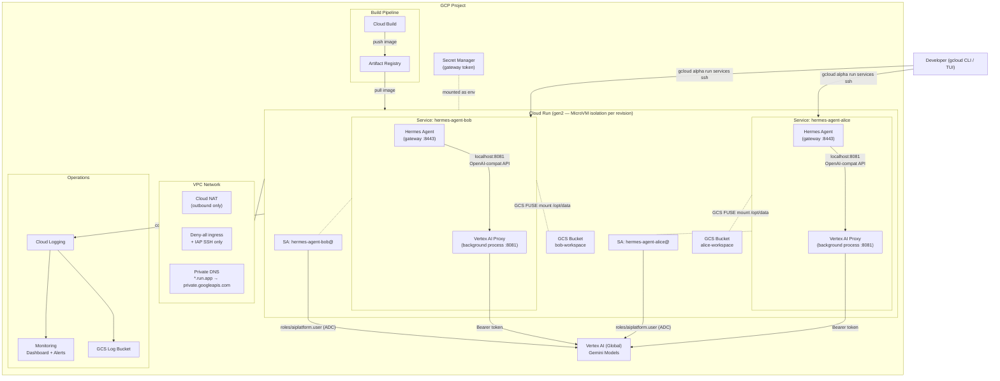

# Hermes Agent on GCP Cloud Run

Deploy [Hermes Agent](https://github.com/nousresearch/hermes-agent) on Google Cloud with Cloud Run, Vertex AI via ADC — infrastructure managed by Terraform, services deployed via `gcloud`.

---

## Table of Contents

- [Architecture](#architecture)
- [Security Enhancements](#security-enhancements)
- [Deployment Guide](#deployment-guide)
  - [Step 1: Create the GCP Project and State Bucket](#step-1-create-the-gcp-project-and-state-bucket)
  - [Step 2: Configure Variables](#step-2-configure-variables)
  - [Step 3: Deploy Infrastructure with Terraform](#step-3-deploy-infrastructure-with-terraform)
  - [Step 4: Deploy Cloud Run Services](#step-4-deploy-cloud-run-services)
  - [Step 5: Verify](#step-5-verify)
- [Adding Messaging Channels](#adding-messaging-channels)
  - [Telegram](#telegram)
- [Testing with TUI](#testing-with-tui)
- [File Structure](#file-structure)

---

## Architecture

[Back to top](#table-of-contents)



### Component Overview

| Component | Purpose |
|-----------|---------|
| **Cloud Run gen2** | MicroVM execution environment with seccomp syscall filtering + Sandbox2 Linux namespace isolation; required for GCS FUSE mounts |
| **Vertex AI Proxy** | Lightweight Python background process (~200 LOC) replacing LiteLLM; runs inside the same container and injects ADC Bearer tokens into OpenAI-compatible requests |
| **Per-Developer Service Accounts** | Each developer's Cloud Run service runs with a dedicated SA — no shared credentials, separate audit trail |
| **GCS FUSE Workspace** | Each developer's `/opt/data` is backed by their own GCS bucket, providing unlimited persistent storage across revisions |
| **DNS Private Google Access** | Private DNS zone routes `*.run.app` to `private.googleapis.com` VIPs for internal Cloud Run → Cloud Run calls |
| **Cloud Build** | Builds and pushes the Hermes container image to Artifact Registry |
| **Cloud Monitoring** | Dashboard with Cloud Run metrics, alert policies for container crashes and proxy errors |
| **Cloud Logging** | Logs routed to GCS with lifecycle policies (90d Nearline, 365d Coldline) |

[Back to top](#table-of-contents)

---

## Security Enhancements

[Back to top](#table-of-contents)

This deployment implements defense-in-depth across infrastructure, network, identity, and application layers.

### Infrastructure Layer

#### Cloud Run Sandboxing

Every Cloud Run gen2 revision runs inside a hardware-backed MicroVM with:

- **Sandbox2 Linux namespace isolation** — each container instance gets its own namespaced view of the filesystem, network, and process tree.
- **seccomp syscall filtering** — restricts the set of syscalls available to the container, reducing the attack surface for kernel exploits.
- **GCS FUSE support** — gen2 is required for mounting GCS buckets as a FUSE filesystem.

#### Per-Developer Isolation

Each developer gets:
- A dedicated Cloud Run service with its own revision history
- A dedicated GCS workspace bucket (only that SA has `roles/storage.objectUser`)
- A dedicated service account with strictly scoped IAM bindings

There is no shared filesystem — Alice's `/opt/data` bucket cannot be accessed by Bob's service account.

### Network Layer

| Control | Implementation |
|---------|---------------|
| Direct VPC Egress | Cloud Run containers egress through the VPC subnet (no public IP on containers) |
| Cloud NAT | Outbound-only internet access for pulling images and calling Vertex AI |
| Deny-all ingress firewall | Default deny on the VPC; only IAP SSH (35.235.240.0/20) is allowed |
| Private DNS for `*.run.app` | Internal Cloud Run service calls stay on the Google private network |

### Identity Layer

#### Zero API Keys

The entire authentication chain uses identity federation — no API keys stored anywhere:

```
Cloud Run Service → GCP Service Account → Vertex AI
```

- The Vertex AI proxy calls `google.auth.default()` to obtain credentials via the metadata server.
- Tokens are automatically refreshed before expiry — no key rotation needed.
- The only secret stored is the gateway auth token (auto-generated, stored in Secret Manager).

#### IAM Least Privilege

Each developer's service account has only:

| Role | Purpose |
|------|---------|
| `roles/aiplatform.user` | Call Vertex AI Gemini models |
| `roles/logging.logWriter` | Write structured logs |
| `roles/monitoring.metricWriter` | Write custom metrics |
| `roles/run.invoker` | Call other internal Cloud Run services |
| `roles/storage.objectUser` | Read/write their own workspace GCS bucket only |
| `roles/secretmanager.secretAccessor` | Read gateway token (per-secret binding, not project-wide) |

### Application Layer (Hermes Security Features)

These features are configured in `hermes-config.yaml.template` and enforced inside every container.

#### Dangerous Command Approval

All destructive commands require explicit human approval before execution. Configured as:

```yaml
approvals:
  mode: "manual"    # Always prompt — never auto-approve
  timeout: 60       # Deny if no response within 60 seconds (fail-closed)
```

Hermes checks every command against a curated list of dangerous patterns (`rm -rf`, `DROP TABLE`, `chmod 777`, `curl | sh`, `kill -9`, etc.). Matching commands are blocked until the user explicitly approves. See the [Hermes security docs](https://hermes-agent.nousresearch.com/docs/user-guide/security) for the full pattern list.

[Back to top](#table-of-contents)

#### Tirith Pre-Exec Scanning

[Tirith](https://github.com/sheeki03/tirith) scans every command before execution, catching threats that pattern matching alone misses:

- **Homograph URL spoofing** — internationalized domain attacks (e.g., `gооgle.com` with Cyrillic "o")
- **Pipe-to-interpreter** — `curl | bash`, `wget | sh` and variants
- **Terminal injection** — escape sequence attacks

Configured with `fail_open: false` — if Tirith is unavailable, commands are **blocked** (fail-closed):

```yaml
security:
  tirith:
    enabled: true
    fail_open: false
```

[Back to top](#table-of-contents)

#### SSRF Protection (Built-in)

Hermes automatically blocks all URL-capable tools (web search, browser, vision) from accessing:

- Private networks (RFC 1918): `10.0.0.0/8`, `172.16.0.0/12`, `192.168.0.0/16`
- Loopback: `127.0.0.0/8`, `::1`
- Link-local / cloud metadata: `169.254.0.0/16` (includes `169.254.169.254`)
- CGNAT: `100.64.0.0/10`
- Cloud metadata hostnames: `metadata.google.internal`, `metadata.goog`

This is always active and cannot be disabled. DNS failures are fail-closed.

[Back to top](#table-of-contents)

#### GCP Metadata Endpoint Blocklist

In addition to the built-in SSRF protection, a website blocklist explicitly blocks GCP metadata endpoints:

```yaml
security:
  website_blocklist:
    enabled: true
    domains:
      - "metadata.google.internal"
      - "metadata.goog"
      - "169.254.169.254"
      - "*.internal"
```

This provides defense-in-depth against metadata exfiltration — even if a future code path bypasses the SSRF filter, the blocklist catches it.

[Back to top](#table-of-contents)

#### Context File Injection Protection (Built-in)

Hermes automatically scans context files (AGENTS.md, .cursorrules, SOUL.md) for prompt injection before including them in the system prompt. The scanner detects:

- Instructions to ignore/disregard prior instructions
- Hidden HTML comments with suspicious keywords
- Attempts to read secrets (`.env`, `credentials`, `.netrc`)
- Credential exfiltration via `curl`
- Invisible Unicode characters (zero-width spaces, bidirectional overrides)

Blocked files are excluded with a warning and never reach the model.

[Back to top](#table-of-contents)

#### Workspace Directory Restriction

The `MESSAGING_CWD` environment variable restricts the gateway agent to `/opt/data/workspace`. The agent cannot operate from sensitive directories like `/etc` or `/opt/hermes`.

[Back to top](#table-of-contents)

#### User Authorization for Messaging Channels

> **Important:** When adding messaging channels (Telegram, LINE, etc.), you **must** configure platform-specific user allowlists. Without allowlists, all users are denied by default (fail-closed).

```bash
# Example: restrict Telegram to specific user IDs
TELEGRAM_ALLOWED_USERS=123456789,987654321
```

Never set `GATEWAY_ALLOW_ALL_USERS=true` in production. Use the DM pairing system for flexible user onboarding — see the [Telegram](#telegram) and [LINE](#line) setup guides.

[Back to top](#table-of-contents)

#### Command Allowlist Audit

Hermes supports a permanent command allowlist (`command_allowlist` in config.yaml) where users can whitelist dangerous command patterns. This allowlist should be:

- **Empty by default** — this deployment ships with no pre-approved patterns
- **Audited periodically** — review with `hermes config edit` to remove overly broad patterns
- **Scoped narrowly** — approve specific commands, not entire categories

[Back to top](#table-of-contents)

### Security Summary

| Layer | Control | Type |
|-------|---------|------|
| Infrastructure | Cloud Run gen2 MicroVM (Sandbox2 + seccomp) | Automatic |
| Infrastructure | Per-developer service + GCS bucket isolation | Automatic |
| Network | Direct VPC Egress, deny-all ingress, Cloud NAT | Automatic |
| Network | Private DNS for `*.run.app` | Configured |
| Identity | ADC via metadata server (zero API keys) | Automatic |
| Identity | Per-developer SA, IAM least privilege | Automatic |
| Identity | Per-secret and per-bucket IAM bindings | Automatic |
| Application | Dangerous command approval (`manual` mode) | Configured |
| Application | Tirith pre-exec scanning (`fail_open: false`) | Configured |
| Application | SSRF protection | Built-in |
| Application | GCP metadata blocklist | Configured |
| Application | Context file injection scanning | Built-in |
| Application | Workspace directory restriction (`MESSAGING_CWD`) | Configured |
| Application | User authorization (fail-closed deny-all) | Default |

[Back to top](#table-of-contents)

---

## Deployment Guide

[Back to top](#table-of-contents)

> **Architecture note:** Terraform provisions the supporting infrastructure (VPC, IAM, Artifact Registry, GCS buckets, Secret Manager, monitoring). The Cloud Run services themselves are deployed with `gcloud run deploy` commands in [Step 4](#step-4-deploy-cloud-run-services). This gives precise control over revision configuration without Terraform managing Cloud Run state.

### Prerequisites

- [Terraform](https://developer.hashicorp.com/terraform/install) >= 1.5
- [gcloud CLI](https://cloud.google.com/sdk/docs/install) authenticated with a project owner account
- A GCP project with billing enabled

### Step 1: Create the GCP Project and State Bucket

```bash
# Use an existing project
export PROJECT_ID="your-project-id"

# Create a new project (optional)
gcloud projects create $PROJECT_ID --name="Hermes Agent"
gcloud config set project $PROJECT_ID

# Link billing account (optional)
gcloud billing accounts list
gcloud billing projects link $PROJECT_ID --billing-account=XXXXXX-XXXXXX-XXXXXX

export TF_STATE_BUCKET_REGION="asia-southeast1"
export REGION="us-central1"

# Create Terraform state bucket
gsutil mb -p $PROJECT_ID -l $TF_STATE_BUCKET_REGION "gs://${PROJECT_ID}-hermes-run-tf-state"
gsutil versioning set on gs://${PROJECT_ID}-hermes-run-tf-state
```

### Step 2: Configure Variables

Copy the example and edit:

```bash
cp terraform.tfvars.example terraform.tfvars
```

Edit `terraform.tfvars`:

```hcl
# Required
project_id = "your-project-id"

# Region for Cloud Run and Artifact Registry
region = "us-central1"

# Vertex AI endpoint region ("global" recommended for widest model availability)
vertex_location = "global"

# Default model
hermes_default_model = "gemini-3.1-flash-lite-preview"

# Model aliases (short name -> Vertex AI model ID)
vertex_model_aliases = {
  "gemini-3.1-flash-lite-preview" = "gemini-3.1-flash-lite-preview"
  "gemini-2.5-flash"              = "gemini-2.5-flash"
}

# Developers — each gets a dedicated Cloud Run service and GCS workspace bucket
developers = {
  "alice" = { active = true }
  "bob"   = { active = true }
}

# Alerts (optional)
alert_email = "you@example.com"
```

### Step 3: Deploy

```bash
terraform init -backend-config="bucket=${PROJECT_ID}-hermes-run-tf-state"
terraform plan
terraform apply
```

This will:
1. Enable all required GCP APIs
2. Create VPC, subnet (for Cloud Run Direct VPC Egress), Cloud NAT, firewall rules
3. Create Private DNS zone routing `*.run.app` to `private.googleapis.com`
4. Create per-developer service accounts with scoped IAM bindings
5. Create per-developer GCS workspace buckets
6. Build the Hermes container image via Cloud Build and push to Artifact Registry
7. Create the gateway token in Secret Manager
8. Set up monitoring dashboard, alert policies, and log sink

Deployment takes approximately 5 minutes

After `terraform apply`, capture the outputs you'll need in Step 4:

```bash
terraform output -json
```

Key outputs:
- `cloudrun_subnet` — subnet name for `--subnet` flag
- `workspace_bucket_names` — per-developer GCS bucket names
- `brain_service_accounts` — per-developer SA emails
- `artifact_registry_url` — image URL
- `gateway_token_secret` — secret name for `--set-secrets`

### Step 4: Deploy Cloud Run Services

Deploy one Cloud Run service per developer. Replace variables with your actual values from `terraform output`.

```bash
export PROJECT_ID="your-project-id"
export REGION="us-central1"
export IMAGE="${REGION}-docker.pkg.dev/${PROJECT_ID}/hermes-agent/hermes:latest"

# Deploy per-developer services
for DEVELOPER in alice bob; do
  SA=$(terraform output -json brain_service_accounts | jq -r ".\"${DEVELOPER}\"")
  BUCKET=$(terraform output -json workspace_bucket_names | jq -r ".\"${DEVELOPER}\"")
  SUBNET=$(terraform output -raw cloudrun_subnet)

  gcloud run deploy "hermes-agent-${DEVELOPER}" \
    --image="${IMAGE}" \
    --project="${PROJECT_ID}" \
    --region="${REGION}" \
    --service-account="${SA}" \
    --execution-environment=gen2 \
    --no-allow-unauthenticated \
    --port=8443 \
    --cpu=1 \
    --memory=2Gi \
    --scaling=1 \
    --network="hermes-vpc" \
    --subnet="${SUBNET}" \
    --vpc-egress=all-traffic \
    --add-volume=name=workspace,type=cloud-storage,bucket="${BUCKET}" \
    --add-volume-mount=volume=workspace,mount-path=/opt/data \
    --set-secrets="GATEWAY_AUTH_TOKEN=hermes-gateway-token:latest" \
    --set-env-vars="HERMES_DEFAULT_MODEL=gemini-2.5-flash" \
    --set-env-vars="VERTEX_LOCATION=global" \
    --set-env-vars="VERTEX_MODEL_ALIASES={\"gemini-2.5-flash\":\"gemini-2.5-flash\",\"gemini-2.5-pro\":\"gemini-2.5-pro\"}" \
    --labels="developer=${DEVELOPER}"
done
```

### Step 5: Verify

```bash
export PROJECT_ID="your-project-id"
export REGION="us-central1"

# List deployed services
gcloud run services list --project=$PROJECT_ID --region=$REGION

# Check service details
gcloud run services describe hermes-agent-alice \
  --project=$PROJECT_ID --region=$REGION

# View recent logs for a developer's service
gcloud logging read \
  'resource.type="cloud_run_revision" AND resource.labels.service_name="hermes-agent-alice"' \
  --project=$PROJECT_ID --limit=20 --format='value(textPayload)'
```

[Back to top](#table-of-contents)

---

## Adding Messaging Channels

[Back to top](#table-of-contents)

Hermes Agent supports messaging platforms as channels. Each platform requires a bot token and configuration in the Cloud Run service environment.

### Telegram

[Back to top](#table-of-contents)

#### 1. Create a Telegram Bot

1. Open Telegram and message [@BotFather](https://t.me/BotFather)
2. Send `/newbot` and follow the prompts
3. Copy the bot token (format: `123456789:ABCdefGHIjklMNOpqrsTUVwxyz`)
4. Send `/setprivacy` → select your bot → choose `Disable` (so the bot can read group messages)

#### 2. Store the Token in Secret Manager

```bash
echo -n "YOUR_BOT_TOKEN" | gcloud secrets create hermes-telegram-token-alice \
  --project=$PROJECT_ID \
  --data-file=- \
  --replication-policy=automatic
```

#### 3. Grant Access to the Developer's SA

```bash
# Get the SA email for this developer
SA=$(gcloud run services describe hermes-agent-alice \
  --project=$PROJECT_ID --region=$REGION \
  --format='value(spec.template.spec.serviceAccountName)')

gcloud secrets add-iam-policy-binding hermes-telegram-token-alice \
  --project=$PROJECT_ID \
  --member="serviceAccount:${SA}" \
  --role="roles/secretmanager.secretAccessor"
```

#### 4. Update the Cloud Run Service with the Bot Token

Bot tokens are mounted as environment variables from Secret Manager — they never touch the filesystem, so Hermes file tools cannot read them.

```bash
gcloud run services update hermes-agent-alice \
  --project=$PROJECT_ID \
  --region=$REGION \
  --update-secrets="TELEGRAM_BOT_TOKEN=hermes-telegram-token-alice:latest" \
  --update-env-vars="TELEGRAM_ALLOWED_USERS=YOUR_TELEGRAM_USER_ID"
```

> **Security:** `TELEGRAM_ALLOWED_USERS` restricts which Telegram user IDs can interact with the bot. Get your user ID from [@userinfobot](https://t.me/userinfobot) on Telegram.

#### 5. Enable Telegram in Hermes Config

```bash
gcloud alpha run services ssh hermes-agent-alice \
  --project=$PROJECT_ID --region=$REGION \
  -- hermes config set messaging.telegram.enabled true
```

Updating the config triggers a new revision automatically.

#### 6. Pair Your Telegram Account

Send any message to your bot on Telegram. It will reply with a pairing code:

> Hi~ I don't recognize you yet! Here's your pairing code: `XXXXXXXX`

Approve the pairing code from inside the container:

```bash
gcloud alpha run services ssh hermes-agent-alice \
  --project=$PROJECT_ID --region=$REGION \
  -- hermes pairing approve telegram XXXXXXXX
```

Replace `XXXXXXXX` with the code shown in Telegram.

#### 7. Test

Send a message to your bot on Telegram. You should now receive a response from Hermes.

[Back to top](#table-of-contents)

---

## Testing with TUI

[Back to top](#table-of-contents)

Step-by-step guide to verify every feature after deployment.

### Prerequisites

```bash
export PROJECT_ID="your-project-id"
export REGION="us-central1"
```

### Test 1: Vertex AI Proxy Health

```bash
gcloud alpha run services ssh hermes-agent-alice \
  --project=$PROJECT_ID --region=$REGION \
  -- curl -s http://127.0.0.1:8081/health
```

Expected: `{"status":"ok"}`

[Back to top](#table-of-contents)

### Test 2: Model Listing

```bash
gcloud alpha run services ssh hermes-agent-alice \
  --project=$PROJECT_ID --region=$REGION \
  -- curl -s http://127.0.0.1:8081/v1/models | python3 -m json.tool
```

Expected: JSON listing your configured model aliases.

[Back to top](#table-of-contents)

### Test 3: Non-Streaming Inference

```bash
gcloud alpha run services ssh hermes-agent-alice \
  --project=$PROJECT_ID --region=$REGION \
  -- curl -s http://127.0.0.1:8081/v1/chat/completions \
  -H 'Content-Type: application/json' \
  -d '{"model":"gemini-2.5-flash","messages":[{"role":"user","content":"What is 2+2?"}],"stream":false}' \
  | python3 -m json.tool
```

Expected: A JSON response with `choices[0].message.content` containing "4".

[Back to top](#table-of-contents)

### Test 4: Streaming (SSE) Inference

```bash
gcloud alpha run services ssh hermes-agent-alice \
  --project=$PROJECT_ID --region=$REGION \
  -- curl -s http://127.0.0.1:8081/v1/chat/completions \
  -H 'Content-Type: application/json' \
  -d '{"model":"gemini-2.5-flash","messages":[{"role":"user","content":"Write a haiku about clouds"}],"stream":true}'
```

Expected: Multiple `data: {...}` lines with `object: "chat.completion.chunk"`, ending with `data: [DONE]`.

[Back to top](#table-of-contents)

### Test 5: Hermes Agent Health

```bash
gcloud alpha run services ssh hermes-agent-alice \
  --project=$PROJECT_ID --region=$REGION \
  -- hermes doctor
```

Expected: Lists available tools (terminal, file operations, git, python, etc.) and confirms the custom provider is configured.

[Back to top](#table-of-contents)

### Test 6: Interactive Chat Session

```bash
# Start an interactive shell, then run hermes chat
gcloud alpha run services ssh hermes-agent-alice \
  --project=$PROJECT_ID --region=$REGION

# Inside the container:
cd /opt/data/workspace
hermes chat
```

In the chat:
1. Type: `Hello, what model are you?` — Verify the model responds and identifies itself as Gemini.
2. Type: `What is the capital of France?` — Verify multi-turn works (it should remember context).
3. Press `Ctrl+C` to quit.

You can also run a single non-interactive query:

```bash
gcloud alpha run services ssh hermes-agent-alice \
  --project=$PROJECT_ID --region=$REGION \
  -- bash -c 'cd /opt/data/workspace && hermes chat -q "What is 2+2?"'
```

[Back to top](#table-of-contents)

### Test 7: Tool Execution (Terminal)

In the interactive chat session, ask Hermes to run commands:

```
> List the files in the current directory
> Create a file called test.txt with "hello world" in it
> Read back the contents of test.txt
> What is my current working directory?
```

Verify Hermes uses terminal tools to execute these and returns correct results.

[Back to top](#table-of-contents)

### Test 8: Sandbox Verification

```bash
# gen2 MicroVM restricts direct kernel access
gcloud alpha run services ssh hermes-agent-alice \
  --project=$PROJECT_ID --region=$REGION \
  -- dmesg 2>&1 | head -5
# Expected: permission denied or operation not permitted
# (Sandbox blocks direct kernel buffer reads)

# Verify GCS FUSE mount is active
gcloud alpha run services ssh hermes-agent-alice \
  --project=$PROJECT_ID --region=$REGION \
  -- mount | grep fuse
# Expected: a gcsfuse entry for /opt/data
```

[Back to top](#table-of-contents)

### Test 9: Multi-Developer Isolation

```bash
# Write a file in alice's service
gcloud alpha run services ssh hermes-agent-alice \
  --project=$PROJECT_ID --region=$REGION \
  -- bash -c 'echo "alice-private" > /opt/data/secret.txt'

# Verify bob cannot see it
gcloud alpha run services ssh hermes-agent-bob \
  --project=$PROJECT_ID --region=$REGION \
  -- cat /opt/data/secret.txt 2>&1
# Expected: "No such file or directory"

# Verify alice can still read it
gcloud alpha run services ssh hermes-agent-alice \
  --project=$PROJECT_ID --region=$REGION \
  -- cat /opt/data/secret.txt
# Expected: "alice-private"
```

[Back to top](#table-of-contents)

### Test 10: GCS Workspace Persistence

```bash
# Write a marker file
gcloud alpha run services ssh hermes-agent-alice \
  --project=$PROJECT_ID --region=$REGION \
  -- bash -c 'echo "persist-test" > /opt/data/marker.txt'

# Force a new revision (simulates container restart)
gcloud run services update hermes-agent-alice \
  --project=$PROJECT_ID --region=$REGION \
  --update-env-vars="TEST_REVISION=$(date +%s)"

# Wait for new revision to be ready
gcloud run services describe hermes-agent-alice \
  --project=$PROJECT_ID --region=$REGION \
  --format='value(status.latestReadyRevisionName)'

# Verify the file survived
gcloud alpha run services ssh hermes-agent-alice \
  --project=$PROJECT_ID --region=$REGION \
  -- cat /opt/data/marker.txt
# Expected: "persist-test"
```

[Back to top](#table-of-contents)

### Test 11: Logging Pipeline

```bash
# Check logs are flowing to Cloud Logging
gcloud logging read \
  'resource.type="cloud_run_revision" AND resource.labels.service_name=~"hermes-agent-.*"' \
  --project=$PROJECT_ID --limit=5 --format='value(textPayload)'

# Verify log sink exists
gcloud logging sinks list --project=$PROJECT_ID

# Verify alert policies
gcloud alpha monitoring policies list --project=$PROJECT_ID \
  --format='table(displayName,enabled)'
```

Expected:
- Recent log entries from Hermes containers
- `hermes-logs-to-gcs` sink pointing to a GCS bucket
- Two alert policies: `Container Crash` and `Vertex AI Proxy Errors`, both enabled

[Back to top](#table-of-contents)

### Test 12: Outbound Network Access

```bash
gcloud alpha run services ssh hermes-agent-alice \
  --project=$PROJECT_ID --region=$REGION \
  -- curl -s -o /dev/null -w '%{http_code}' https://www.google.com
# Expected: 200 (Cloud NAT provides outbound access)
```

[Back to top](#table-of-contents)

---

## File Structure

```
hermes-agent-cloudrun/
├── main.tf                          # Providers, backend, API enablement
├── network.tf                       # VPC, subnet, Cloud NAT, firewalls
├── dns_private_google_access.tf     # Private DNS: *.run.app → private.googleapis.com
├── iam.tf                           # Per-developer service accounts and IAM bindings
├── storage.tf                       # Artifact Registry, Cloud Build, GCS workspace buckets, Secret Manager
├── logging.tf                       # Monitoring dashboard, alerts, log sink
├── variables.tf                     # Input variables
├── outputs.tf                       # Output values
├── terraform.tfvars                 # Variable values (do not commit)
├── terraform.tfvars.example         # Example variable values
├── .gcloudignore                    # Files excluded from Cloud Build context
├── Dockerfile                       # Hermes Agent container image
├── hermes-config.yaml.template      # Hermes config (rendered at startup)
└── scripts/
    ├── entrypoint.sh                # Container entrypoint (proxy + Hermes)
    ├── vertex_ai_proxy.py           # Vertex AI ADC proxy (replaces LiteLLM)
    └── build_and_push.sh            # Cloud Build image build script
```

[Back to top](#table-of-contents)
